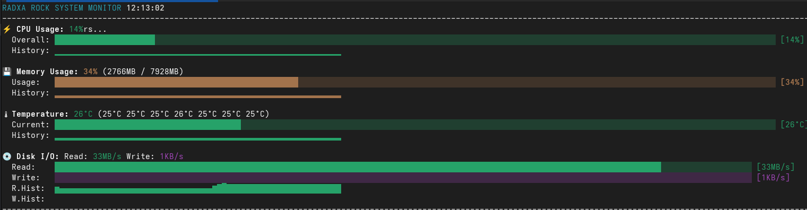

# 🚀 Ollama on Embedded Systems



*Serve Ollama on embedded without pain*

This repository provides tools and scripts for running Ollama on embedded systems and local networks with minimal setup. Includes solutions for network service configuration and SSH connection management with automatic key generation.

**GitHub Repository:** https://github.com/wronai/ollama/

## 🔥 Quick Start

```bash
# Download all scripts
wget https://raw.githubusercontent.com/wronai/ollama/main/ollama.sh
wget https://raw.githubusercontent.com/wronai/ollama/main/ssh.sh
wget https://raw.githubusercontent.com/wronai/ollama/main/monitor.sh
wget https://raw.githubusercontent.com/wronai/ollama/main/test.sh

# Make executable
chmod +x *.sh

# Start Ollama network service
./ollama.sh

# Connect to remote server with automatic SSH key setup
./ssh.sh root@192.168.1.100

# Monitor system performance in real-time
./monitor.sh
```

## 📋 Table of Contents

- [Overview](#overview)
- [Scripts](#scripts)
- [Ollama Network Service](#ollama-network-service)
- [SSH Connection Script](#ssh-connection-script)
- [RK3588 GPU & NPU Support](#rk3588-gpu--npu-support)
- [Installation](#installation)
- [Usage Examples](#usage-examples)
- [API Reference](#api-reference)
- [Troubleshooting](#troubleshooting)
- [Testing](#testing)

## 🔍 Overview

### Ollama Network Service (`ollama.sh`)
Automatically configures Ollama to serve across your entire network, making AI models accessible from any device on your local network. Features include:

- 🌐 Network-wide accessibility
- 🔧 Automatic systemd service creation
- 🔒 Firewall configuration
- 🤖 Automatic model installation (DeepSeek Coder)
- 📊 Comprehensive testing and monitoring
- 🐍 Python API examples

### SSH Connection Script (`ssh.sh`)
Fixes common SSH authentication issues and automatically manages SSH keys:

- 🔐 Automatic ED25519 key generation
- 📋 Automatic key copying to remote hosts
- 🛠️ Fixes "Too many authentication failures" errors
- 🔄 Multiple authentication fallback methods

### Real-time System Monitor (`monitor.sh`)
Advanced ASCII-based system monitoring tool with beautiful visualizations:

- ⚡ **CPU Monitoring**: Overall usage with color-coded indicators
- 💾 **Memory Tracking**: RAM usage in MB/GB with percentage
- 🌡️ **Temperature Monitoring**: All thermal sensors with warnings
- 💿 **Disk I/O Tracking**: Real-time read/write speeds across all storage devices
- 📈 **Historical Data**: Sparkline graphs showing trends over time
- 🎨 **ASCII Graphics**: Beautiful progress bars and color-coded displays
- 📱 **Responsive Design**: Adapts to any terminal width

## 📁 Scripts

### `ollama.sh`
Main script for setting up Ollama network service.

**Key Features:**
- Serves Ollama on specified port (default: 11434)
- Creates systemd service for automatic startup
- Configures firewall rules
- Installs DeepSeek Coder model automatically
- Provides comprehensive testing and examples

### `ssh.sh`
SSH connection script with automatic key management.

**Key Features:**
- Generates ED25519 SSH keys if not present
- Copies keys to remote hosts automatically
- Handles authentication failures gracefully
- Multiple fallback authentication methods

### `monitor.sh`
Real-time ASCII system monitoring tool.

**Key Features:**
- CPU, Memory, Temperature, and Disk I/O monitoring
- Beautiful ASCII progress bars and sparkline graphs
- Color-coded status indicators (Green/Yellow/Red)
- Historical data visualization
- Cross-platform compatibility (ARM/x86)
- Responsive terminal layout

## 🌐 Ollama Network Service

### Quick Start

```bash
# Make executable
chmod +x ollama.sh

# Start with default settings (port 11434)
./ollama.sh

# Start on custom port
./ollama.sh -p 8081

# Test the service
./ollama.sh --test

# View API examples
./ollama.sh --examples
```

### Service Management

```bash
# Check service status
sudo systemctl status ollama-network

# Start/stop/restart service
sudo systemctl start ollama-network
sudo systemctl stop ollama-network
sudo systemctl restart ollama-network

# View logs
sudo journalctl -u ollama-network -f

# Enable/disable auto-start
sudo systemctl enable ollama-network
sudo systemctl disable ollama-network
```

### Network Access

Once running, your Ollama service will be accessible from any device on your network:

```bash
# Replace 192.168.1.100 with your server's IP
curl http://192.168.1.100:11434/api/tags
```

### Available Commands

| Command | Description |
|---------|-------------|
| `./ollama.sh` | Start service with default settings |
| `./ollama.sh -p PORT` | Start on specific port |
| `./ollama.sh --stop` | Stop the service |
| `./ollama.sh --status` | Show service status |
| `./ollama.sh --test` | Run comprehensive tests |
| `./ollama.sh --examples` | Show API usage examples |
| `./ollama.sh --install-model` | Install DeepSeek Coder model |
| `./ollama.sh --logs` | View service logs |

## 🔐 SSH Connection Script

### Quick Start

```bash
# Make executable
chmod +x ssh.sh

# Connect to remote host (will generate keys if needed)
./ssh.sh root@192.168.1.100

# Connect to different host
./ssh.sh user@hostname.local
```

### What it does automatically:

1. **Checks for ED25519 key** - generates if missing
2. **Copies key to remote host** - prompts for password once
3. **Establishes connection** - uses key authentication
4. **Handles failures** - falls back to password auth if needed

### Key Files Created:
- `~/.ssh/id_ed25519` - Private key
- `~/.ssh/id_ed25519.pub` - Public key

## 📊 Real-time System Monitor

### Quick Start

```bash
# Make executable
chmod +x monitor.sh

# Start monitoring
./monitor.sh

# Exit with Ctrl+C or press 'q'
```

### Display Sections

#### ⚡ CPU Usage
```
⚡ CPU Usage: 25%
  Overall: ███████░░░░░░░░░░░░░░ [25%]
  History: ▁▂▃▄▅▆▇█▇▆▅▄▃▂▁▂▃▄▅▆
```

#### 💾 Memory Usage
```
💾 Memory Usage: 45% (3584MB / 7928MB)
  Usage:   ███████████░░░░░░░░░ [45%]
  History: ▃▄▅▄▃▄▅▆▅▄▃▄▅▄▃▄▅▄▃▄
```

#### 🌡️ Temperature Monitoring
```
🌡️ Temperature: 42°C (38°C 41°C 42°C 39°C)
  Current: ████████░░░░░░░░░░░░ [42°C]
  History: ▃▃▄▄▅▅▄▄▃▃▄▄▅▅▆▆▅▅▄▄
```

#### 💿 Disk I/O Tracking
```
💿 Disk I/O: Read: 15.2MB/s Write: 8.7MB/s
  Read:    ████████████░░░░░░░░ [15.2MB/s]
  Write:   ██████░░░░░░░░░░░░░░ [8.7MB/s]
  R.Hist:  ▁▂▃▄▅▆▇▆▅▄▃▂▁▂▃▄▅▆▇▆
  W.Hist:  ▁▁▂▂▃▃▄▄▅▅▄▄▃▃▂▂▁▁▂▂
```

### Color Scheme
- 🟢 **Green**: Good (0-30% usage, < 50°C)
- 🟡 **Yellow**: Warning (30-70% usage, 50-70°C)
- 🔴 **Red**: Critical (70%+ usage, > 70°C)

### Performance Testing
Generate system load for testing the monitor:

```bash
# CPU stress test
stress --cpu 4 --timeout 30s

# Memory stress test  
stress --vm 2 --vm-bytes 1G --timeout 30s

# Disk I/O test
dd if=/dev/zero of=/tmp/test bs=1M count=500
sudo hdparm -t /dev/mmcblk0

# Temperature monitoring during load
# Monitor will show real-time changes in all metrics
```

## 🛠️ Installation

### Prerequisites

**For Ollama Service:**
- Linux system with systemd
- Ollama installed (`curl -fsSL https://ollama.ai/install.sh | sh`)
- Root or sudo access
- Network connectivity

**For SSH Script:**
- OpenSSH client
- ssh-keygen utility
- ssh-copy-id utility

**For System Monitor:**
- Linux system with /proc and /sys filesystems
- Bash 4.0+
- Unicode-capable terminal
- 256-color terminal support (recommended)

### One-Line Installation

```bash
# Download and setup everything
curl -fsSL https://raw.githubusercontent.com/wronai/ollama/main/install.sh | bash
```

### Manual Installation

1. **Download scripts:**
```bash
wget https://raw.githubusercontent.com/wronai/ollama/main/ollama.sh
wget https://raw.githubusercontent.com/wronai/ollama/main/ssh.sh
wget https://raw.githubusercontent.com/wronai/ollama/main/monitor.sh
```

2. **Make executable:**
```bash
chmod +x ollama.sh ssh.sh
```

3. **Install Ollama (if needed):**
```bash
curl -fsSL https://ollama.ai/install.sh | sh
```

4. **Run scripts:**
```bash
# Start Ollama network service
./ollama.sh

# Connect to remote server
./ssh.sh user@hostname

# Monitor system performance
./monitor.sh
```

### Alternative Download Methods

```bash
# Using curl
curl -O https://raw.githubusercontent.com/wronai/ollama/main/ollama.sh
curl -O https://raw.githubusercontent.com/wronai/ollama/main/ssh.sh
curl -O https://raw.githubusercontent.com/wronai/ollama/main/monitor.sh

# Clone entire repository
git clone https://github.com/wronai/ollama.git
cd ollama
chmod +x *.sh
```

## 📚 Usage Examples

### Ollama API Examples

#### 1. List Available Models
```bash
curl -s http://192.168.1.100:11434/api/tags | jq '.models[].name'
```

#### 2. Generate Code
```bash
curl -X POST http://192.168.1.100:11434/api/generate \
     -H 'Content-Type: application/json' \
     -d '{
       "model": "deepseek-coder:1.3b",
       "prompt": "Write a Python function to sort a list",
       "stream": false
     }'
```

#### 3. Chat Conversation
```bash
curl -X POST http://192.168.1.100:11434/api/chat \
     -H 'Content-Type: application/json' \
     -d '{
       "model": "deepseek-coder:1.3b",
       "messages": [
         {"role": "user", "content": "Explain recursion in programming"}
       ],
       "stream": false
     }'
```

#### 4. Pull New Model
```bash
curl -X POST http://192.168.1.100:11434/api/pull \
     -H 'Content-Type: application/json' \
     -d '{"name": "mistral:latest"}'
```

#### 5. Streaming Response
```bash
curl -X POST http://192.168.1.100:11434/api/generate \
     -H 'Content-Type: application/json' \
     -d '{
       "model": "deepseek-coder:1.3b",
       "prompt": "Create a REST API in Python",
       "stream": true
     }'
```

### Python Client Example

```python
import requests
import json

class OllamaClient:
    def __init__(self, host="192.168.1.100", port=11434):
        self.base_url = f"http://{host}:{port}"
    
    def generate(self, model, prompt, stream=False):
        response = requests.post(
            f"{self.base_url}/api/generate",
            json={
                "model": model,
                "prompt": prompt,
                "stream": stream
            }
        )
        return response.json()
    
    def chat(self, model, messages, stream=False):
        response = requests.post(
            f"{self.base_url}/api/chat",
            json={
                "model": model,
                "messages": messages,
                "stream": stream
            }
        )
        return response.json()
    
    def list_models(self):
        response = requests.get(f"{self.base_url}/api/tags")
        return response.json()

# Usage
client = OllamaClient()

# Generate code
result = client.generate(
    "deepseek-coder:1.3b", 
    "Write a function to calculate fibonacci numbers"
)
print(result['response'])

# Chat
messages = [{"role": "user", "content": "What is machine learning?"}]
result = client.chat("deepseek-coder:1.3b", messages)
print(result['message']['content'])
```

### SSH Examples

```bash
# Connect to server (first time - will setup keys)
./ssh.sh root@192.168.1.100

# Connect to different user
./ssh.sh admin@server.local

# Connect to server with non-standard port (manual)
ssh -p 2222 -i ~/.ssh/id_ed25519 root@192.168.1.100
```

## 📖 API Reference

### Ollama REST API Endpoints

| Endpoint | Method | Description |
|----------|--------|-------------|
| `/api/tags` | GET | List available models |
| `/api/generate` | POST | Generate text completion |
| `/api/chat` | POST | Chat conversation |
| `/api/pull` | POST | Download model |
| `/api/push` | POST | Upload model |
| `/api/show` | POST | Show model information |
| `/api/copy` | POST | Copy model |
| `/api/delete` | DELETE | Delete model |

### Request/Response Examples

#### Generate Text
**Request:**
```json
{
  "model": "deepseek-coder:1.3b",
  "prompt": "Write hello world in Python",
  "stream": false,
  "options": {
    "temperature": 0.7,
    "top_p": 0.9
  }
}
```

**Response:**
```json
{
  "model": "deepseek-coder:1.3b",
  "created_at": "2025-06-02T08:42:07.311663549Z",
  "response": "print(\"Hello, World!\")",
  "done": true,
  "context": [...],
  "total_duration": 1234567890,
  "load_duration": 1234567,
  "prompt_eval_duration": 1234567,
  "eval_count": 10,
  "eval_duration": 1234567890
}
```

## 🔧 Troubleshooting

### Common Issues

#### Ollama Service Won't Start
```bash
# Check if port is in use
ss -tlnp | grep :11434

# Check service logs
sudo journalctl -u ollama-network -f

# Restart service
sudo systemctl restart ollama-network

# Check firewall
sudo ufw status
```

#### Network Access Issues
```bash
# Test local connection first
curl http://localhost:11434/api/tags

# Check firewall rules
sudo ufw allow 11434/tcp

# Check if service binds to all interfaces
ss -tlnp | grep :11434
# Should show 0.0.0.0:11434, not 127.0.0.1:11434
```

#### SSH Connection Problems
```bash
# Clear SSH agent
ssh-add -D

# Remove old host keys
ssh-keygen -R hostname

# Try with password only
ssh -o IdentitiesOnly=yes -o PreferredAuthentications=password user@host

# Debug connection
ssh -v user@host
```

#### Model Download Failures
```bash
# Check disk space
df -h

# Check internet connection
curl -I https://ollama.ai

# Try smaller model
ollama pull tinyllama

# Check Ollama logs
tail -f /tmp/ollama.log
```

### Performance Optimization

#### For Better Performance:
```bash
# Increase model context (if you have RAM)
export OLLAMA_CONTEXT_LENGTH=8192

# Enable GPU acceleration (if available)
export OLLAMA_INTEL_GPU=1

# Adjust concurrent requests
export OLLAMA_MAX_QUEUE=512
```

#### Monitor Resource Usage:
```bash
# CPU and memory usage
htop

# GPU usage (if applicable)
nvidia-smi

# Disk usage
df -h ~/.ollama/models/
```

### Security Considerations

#### Network Security:
- 🔒 Only run on trusted networks
- 🛡️ Consider using VPN for remote access
- 🚫 Don't expose to public internet without authentication
- 🔐 Use firewall rules to restrict access

#### SSH Security:
- 🔑 ED25519 keys are more secure than RSA
- 🚫 Disable password authentication after key setup
- 🔒 Use SSH agent for key management
- 📝 Regularly rotate SSH keys

## 🚀 RK3588 GPU & NPU Support

This repository includes comprehensive support for RK3588's hardware acceleration capabilities, including both the Mali-G610 GPU and the Neural Processing Unit (NPU).

### Key Features

- **Mali-G610 GPU Support**
  - OpenCL acceleration
  - 3D graphics support
  - Hardware-accelerated video processing

- **RKNN NPU Support**
  - High-performance neural network acceleration
  - Support for TensorFlow, PyTorch, and ONNX models
  - Optimized for computer vision and AI workloads

### Getting Started

1. **Install Dependencies**
   ```bash
   # Install GPU drivers and OpenCL
   ./rkgpu.sh
   
   # Install NPU drivers and tools
   ./rknpu.sh
   ```

2. **Verify Installation**
   ```bash
   # Test GPU functionality
   ./testgpu.sh
   
   # Test NPU functionality
   ./testnpu.sh
   ```

3. **Using with Ollama**
   ```bash
   # Enable GPU acceleration
   OLLAMA_GPU=1 ollama serve
   
   # Enable NPU acceleration (experimental)
   OLLAMA_NPU=1 ollama serve
   ```

For detailed documentation, see [RK3588 Documentation](RK.md) and [Testing Guide](Test.md).

## 🧪 Testing

We provide comprehensive testing tools to verify your RK3588 hardware acceleration setup:

### GPU Testing (`testgpu.sh`)
```bash
# Run all GPU tests
./testgpu.sh

# Run specific test category
./testgpu.sh --category opencl
```

### NPU Testing (`testnpu.sh`)
```bash
# Run all NPU tests
./testnpu.sh

# Test specific model
./testnpu.sh --model path/to/model.rknn
```

### Test Coverage
- Hardware detection
- Driver verification
- Performance benchmarking
- Memory bandwidth tests
- Model loading and inference

For detailed testing documentation, see [Test.md](Test.md).

## 📞 Support

### Getting Help

1. **GitHub Issues:** https://github.com/wronai/ollama/issues
2. **Check Ollama logs:** `sudo journalctl -u ollama-network -f`
3. **Test Ollama connectivity:** `./ollama.sh --test`
4. **View Ollama examples:** `./ollama.sh --examples`
5. **Check Ollama service status:** `sudo systemctl status ollama-network`
6. **System monitor troubleshooting:**
   ```bash
   # Check terminal capabilities
   echo $TERM
   tput cols; tput lines
   
   # Test system access
   cat /proc/stat | head -5
   ls /sys/class/thermal/
   cat /proc/diskstats | head -5
   ```

### Useful Commands

```bash
# Complete system status check
./ollama.sh --test
./monitor.sh &  # Start monitor in background

# View all running services
systemctl list-units --type=service --state=running | grep ollama

# Check network configuration for Ollama
ip addr show
ss -tlnp | grep ollama

# Monitor real-time logs
tail -f /var/log/syslog | grep ollama

# System performance baseline
# Terminal 1: Start monitoring
./monitor.sh

# Terminal 2: Generate test load
stress --cpu 2 --vm 1 --vm-bytes 500M --timeout 60s
sudo hdparm -t /dev/mmcblk0
```

---

## 🤝 Contributing

Contributions welcome! Please feel free to submit issues and pull requests to the [GitHub repository](https://github.com/wronai/ollama/).

### How to Contribute:

1. **Fork the repository**
2. **Create a feature branch:** `git checkout -b feature-name`
3. **Make your changes**
4. **Test thoroughly**
5. **Submit a pull request**

### Reporting Issues:

- 🐛 **Bug reports:** https://github.com/wronai/ollama/issues
- 💡 **Feature requests:** https://github.com/wronai/ollama/issues
- 📚 **Documentation improvements:** Welcome!

---

## 📄 License

This project is open source. Feel free to modify and distribute.

**Repository:** https://github.com/wronai/ollama/

---

**Happy coding with Ollama! 🚀🤖**
